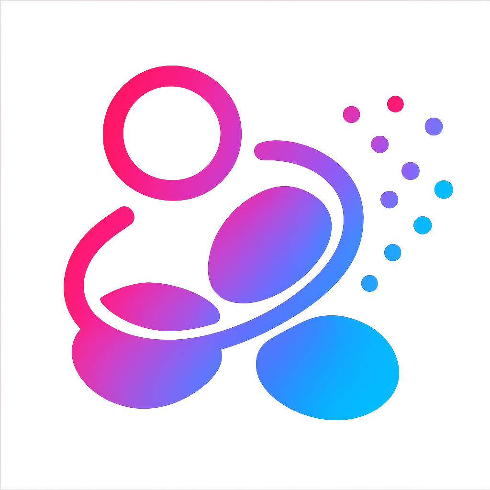

<h1 align="center">
  
  GS2E: Gaussian Splatting is an Effective Data Generator for Event Stream Generation
</h1>

<h5 align="center">

 

</h5>

This repository provides the official implementation of the paper  
<a href="https://github.com/PKU-YuanGroup/GS2Event-Simulator">
<b>GS2E: Gaussian Splatting is an Effective Data Generator for Event Stream Generation</b>
</a>,  
which introduces a novel pipeline that leverages 3D Gaussian Splatting to manipulate camera trajectories, render photorealistic image sequences, and simulate dense, high-fidelity event streams for advancing event-based vision research.

## Gallery
We showcase a selection of paired RGB-Event samples generated by GS2E, along with visualizations of the simulated event streams as videos.

## Create Your Own Event Dataset
GS2E offers a fully implemented pipeline for constructing custom event datasets from rendered image sequences.  
With support for trajectory editing, event simulation, and visualization, users can easily adapt the framework to generate high-quality event streams tailored to their own scenes.

🚧 The full codebase is being cleaned and documented.  
It will be publicly available soon. 
Feel free to ⭐️ this repository to get notified when it's released!

