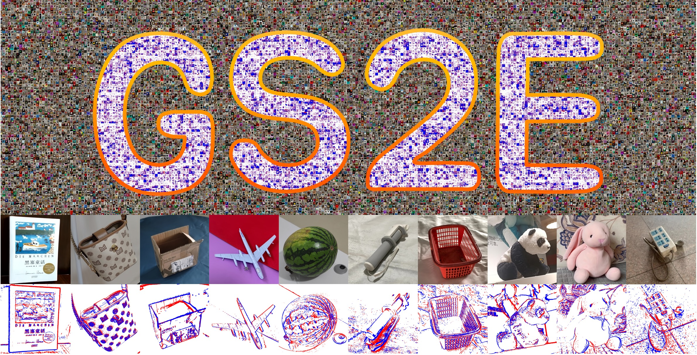

<h2 align="center"> 
  <a href="https://github.com/PKU-YuanGroup/GS2E"> GS2E: Gaussian Splatting is an Effective Data Generator for Event Stream Generation </a>
</h2>

<h5 align="center">
  If you like our project, please give us a star ⭐ on GitHub for the latest update.
</h5>

<h5 align="center">

  <a href="https://arxiv.org/abs/2505.15287">
    
  </a>
  <a href="http://intothemild.github.io/GS2E.github.io">
  
  </a>
  <a href="https://huggingface.co/datasets/Falcary/GS2E">
    
  </a>
  <a href="https://github.com/PKU-YuanGroup/GS2E/blob/main/LICENSE">
    
  </a>
  <a href="https://github.com/PKU-YuanGroup/GS2E/stargazers">
    
  </a>
  <a href="https://github.com/PKU-YuanGroup/GS2E/network">
    
  </a>
  <a href="https://github.com/PKU-YuanGroup/GS2E/watchers">
    
  </a>
</h5>


<p align="center">
This repository provides the official implementation of the paper  
“<a href="https://github.com/PKU-YuanGroup/GS2Event-Simulator">
<b>GS2E: Gaussian Splatting is an Effective Data Generator for Event Stream Generation</b>
</a>”,  
which introduces a novel pipeline that leverages 3D Gaussian Splatting to manipulate camera trajectories, render photorealistic image sequences, and simulate dense, high-fidelity event streams for advancing event-based vision research.
</p>


## 📌 Overview
We showcase a selection of paired RGB-Event samples generated by GS2E, along with visualizations of the simulated event streams as videos.

<p align="center">
  
</p>

## TODO 
- [x] We have released a portion of the dataset on [Hugging Face](https://huggingface.co/datasets/Falcary/GS2E).  
- [ ] 🚧 The full codebase is being cleaned and documented.  
- [ ] Once accepted, we will release all code and datasets.

## Create Your Own Event Dataset
GS2E offers a fully implemented pipeline for constructing custom event datasets from rendered image sequences.  
With support for trajectory editing, event simulation, and visualization, users can easily adapt the framework to generate high-quality event streams tailored to their own scenes.


### Installation
Follow the steps below to set up the environment and install dependencies.

1. **Clone the repository:**
   ```bash
   git clone git@github.com:PKU-YuanGroup/GS2E.git
   cd GS2E
   ```

2. **Install the necessary dependencies:**

   This project is based on [3D Gaussian Splatting](https://github.com/graphdeco-inria/gaussian-splatting), so please refer to its installation instructions. 

   Some parts of this repository rely on additional packages that were used during the exploratory phase. These components are not essential for reproducing the main results and can be safely ignored during typical usage.


### Acknowledgements
We would like to thank all contributors and collaborators who supported this project. Special thanks to the authors of [3D Gaussian Splatting](https://github.com/graphdeco-inria/gaussian-splatting) for their foundational work, which inspired and enabled this research.

### Citation
If you find our work useful in your research, please consider citing:

```bibtex
@misc{li2025gs2egaussiansplattingeffective,
  title={GS2E: Gaussian Splatting is an Effective Data Generator for Event Stream Generation}, 
  author={Yuchen Li and Chaoran Feng and Zhenyu Tang and Kaiyuan Deng and Wangbo Yu and Yonghong Tian and Li Yuan},
  year={2025},
  eprint={2505.15287},
  archivePrefix={arXiv},
  primaryClass={cs.CV},
  url={https://arxiv.org/abs/2505.15287}, 
}
```